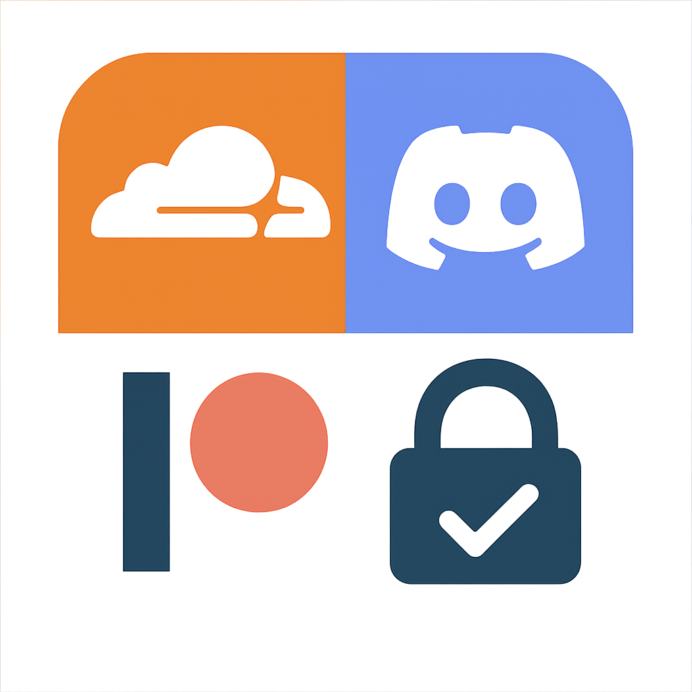

    

#  Cloudflare Patreon-Discord OAuth Worker

A secure Cloudflare Worker that automates Discord access for your Patreon supporters. It connects your Patreon and Discord accounts, checks supporter eligibility, and grants Discord server access or roles—no coding required.

---

## Features
- Discord OAuth2 authentication and callback handling
- Patreon OAuth2 authentication and callback handling
- Automatic Discord guild membership and role assignment based on Patreon tiers
- Dynamic redirect URIs based on request host and protocol
- Secure secret management via Wrangler
- Type-safe request/response validation
- No passwords or personal data stored

---

## How It Works
1. Supporters log in with Discord and Patreon.
2. The worker checks their Patreon membership.
3. If eligible, they’re added to your Discord server and given a special role.

---

## Quick Start
See [SETUP.md](./SETUP.md) for a complete step-by-step setup guide, including prerequisites, configuration, deployment, and troubleshooting.

---

## Endpoints
- `/auth` — Starts Discord OAuth flow
- `/auth/discord/init` — Discord OAuth2 authorization
- `/auth/discord/callback` — Discord OAuth2 callback
- `/auth/patreon/handover` — Patreon OAuth2 authorization
- `/auth/patreon/callback` — Patreon OAuth2 callback
- `/auth/finish` — Token exchange, user info fetch, guild/role management

---

## Project Structure
- `src/index.ts` — Main router and OAuth logic
- `src/helpers.ts` — Redirect helpers, token revocation, and utility functions
- `src/types.ts` — Type definitions for Discord, Patreon, and API payloads
- `src/routes/` — Modular route files for each endpoint
- `package.json` — Project dependencies and scripts
- `README.md` — Project documentation

---

## Security
- OAuth2 is used for both Discord and Patreon; passwords are never stored or seen.
- All secrets (API keys, tokens) are stored securely in Cloudflare and never exposed.
- Tokens are revoked after use for extra security.
- Only eligible users are added to your Discord server.
- No personal data is stored on the worker; it only checks membership and grants access.

---

## Technologies Used
- [Cloudflare Workers](https://workers.dev)
- [Hono](https://hono.dev/)
- [chanfana](https://chanfana.pages.dev/)
- [discord-api-types](https://github.com/discordjs/discord-api-types)
- [TypeScript](https://www.typescriptlang.org/)
- [Zod](https://zod.dev/)

---

## For Patreon Creators
### What is this project?
A secure Cloudflare Worker that connects your Patreon and Discord accounts. It automatically gives your Patreon supporters access to a private Discord server or role, based on their membership.

### How do I use it?
- Deploy the worker using Cloudflare and Wrangler.
- Set up your Discord and Patreon credentials as secrets.
- Share the authentication link with your supporters.

### Security aspects
- OAuth2 is used for both Discord and Patreon, so passwords are never stored or seen.
- All secrets (API keys, tokens) are stored securely in Cloudflare and never exposed.
- Only eligible users are added to your Discord server.
- No personal data is stored on the worker; it only checks membership and grants access.

### Summary
This project automates Discord access for Patreon supporters, is easy to set up, and keeps your credentials and user data secure.